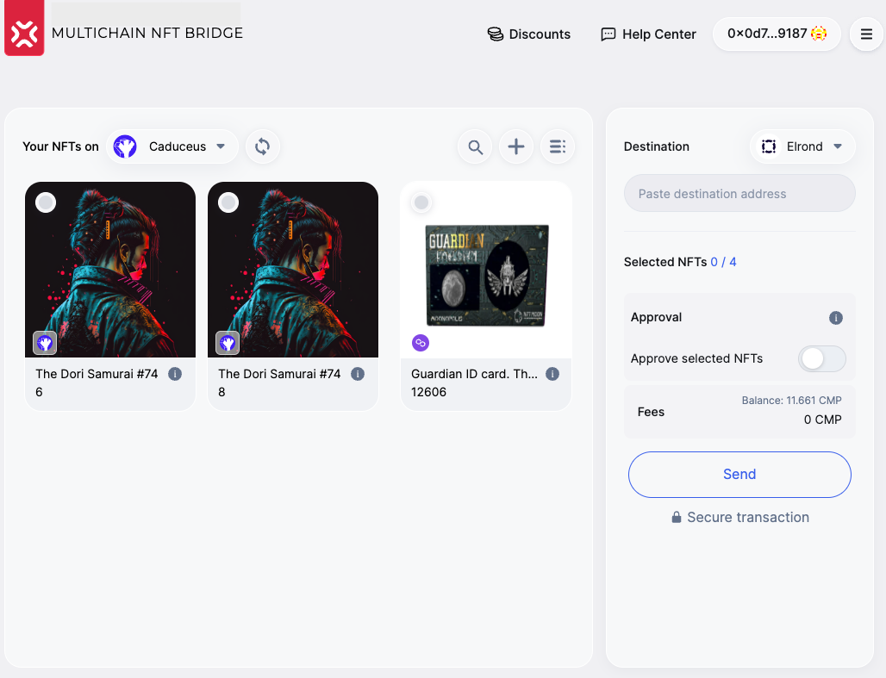
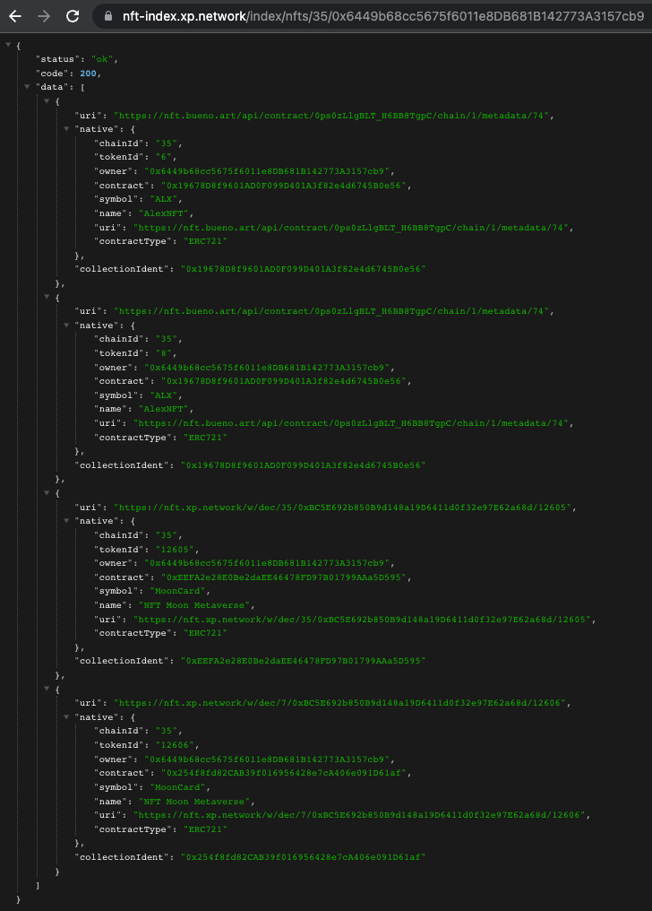
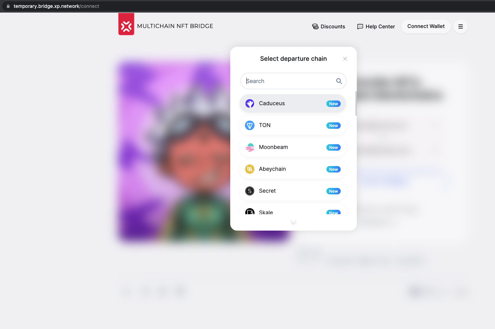

# Milestone-3 Proofs

## 1. Mainnet contract deployment


### Mainnet (Staging for testing before production)

|Contract name|Link|Role|
|:-:|:-:|:-:|
|Bridge|[0x28c43F505d210D6f8f78C58b450b76890dc76F21](https://mainnet.scan.caduceus.foundation/address/0x28c43F505d210D6f8f78C58b450b76890dc76F21?p=1#transactions)|Contracts |
|Default ERC-721|[0x086815f8154e3cdD89cD3aEc78377e3197a572d0](https://mainnet.scan.caduceus.foundation/address/0x086815f8154e3cdD89cD3aEc78377e3197a572d0?p=1#transactions)|Ledger of the foreign ERC-721 tokens|
|Default ERC-1155|[0x820c0b504fe85b43E3c43D2EA24cb764ad78d52e](https://mainnet.scan.caduceus.foundation/address/0x820c0b504fe85b43E3c43D2EA24cb764ad78d52e?p=1#transactions)|Ledger of the foreign ERC-1155 tokens|
|UserNftMInter (UMT)|[0x8411EeadD374bDE549F61a166FFBeFca592bC60a](https://mainnet.scan.caduceus.foundation/address/0x8411EeadD374bDE549F61a166FFBeFca592bC60a?p=1#transactions)|ERC-721 for testing|
|ERC1155Minter|[0xe3266d5181FffE43A205ce5bE9437B9f717Bad84](https://mainnet.scan.caduceus.foundation/address/0xe3266d5181FffE43A205ce5bE9437B9f717Bad84?p=1#transactions)|ERC-1155 for testing|

### Mainnet (Production - for everyone to use)

|Contract name|Link|Role|
|:-:|:-:|:-:|
|Bridge|[0xd3f55Dd3da582E8E55AcE14e28352a95334E8feb](https://mainnet.scan.caduceus.foundation/address/0xd3f55Dd3da582E8E55AcE14e28352a95334E8feb?p=1#transactions)|Contracts |
|Default ERC-721|[0x3410b0e0b1aBAe452b3F031AdE8dab347f5Fb60b](https://mainnet.scan.caduceus.foundation/address/0x3410b0e0b1aBAe452b3F031AdE8dab347f5Fb60b?p=1#transactions)|Ledger of the foreign ERC-721 tokens|
|Default ERC-1155|[0x52e7D07DE51F8163E0f29061EaAa7D3FEaf6b47E](https://mainnet.scan.caduceus.foundation/address/0x52e7D07DE51F8163E0f29061EaAa7D3FEaf6b47E?p=1#transactions)|Ledger of the foreign ERC-1155 tokens|
|UserNftMInter (UMT)|[0x77037e4f8aCb09f9bdedB9311bB6d9e74ed44371](https://mainnet.scan.caduceus.foundation/address/0x77037e4f8aCb09f9bdedB9311bB6d9e74ed44371?p=1#transactions)|ERC-721 for testing|
|ERC1155Minter|[0xcEFC9182e9AB181b3FED4e89CdA55E0B9010aFe1](https://mainnet.scan.caduceus.foundation/address/0xcEFC9182e9AB181b3FED4e89CdA55E0B9010aFe1?p=1#transactions)|ERC-1155 for testing|

## 2. Integrate Caduceus in the Mainnet-validators

Validation logic is responsible for relaying assets from the origin to the chain of destination. It canbe best prooved by the successful transactions. See [Mainnet transactions](#4-extensive-testing-mainnet-transactions)


## 3. Integrate Caduceus in the Mainnet NFT-Indexer

NFT Indexing can be tested in the bridge UI / widget or via API

[UI](https://temporary.bridge.xp.network/connect)



[API Example](https://nft-index.xp.network/index/nfts/35/0x6449b68cc5675f6011e8DB681B142773A3157cb9)

API structure: $ <base-url> / nfts / <chain-nonce> / <user-address> $

```http
https://nft-index.xp.network/index/nfts/35/0x6449b68cc5675f6011e8DB681B142773A3157cb9
```



## 4. Mainnet Testing

Polygon -> Caduceus

|Direction|Chain|Links|Depatrure/Arrival Time|
|:-:|:-:|:-:|:-:|
|From|Polygon|[link](https://polygonscan.com/tx/0xee581806a50fea2a42d389e0febe4e9c8483600fd469cece846c2a4c312482f9)|Dec-08-2022 12:32:54 PM +UTC|
|To|Caduceus|[link](https://mainnet.scan.caduceus.foundation/tx/0x98f43d11b8f17f5d996fefb1eaa2173d551854f96269626de3a646cbafb8cf97#)|Dec-8-2022 12:32:55 PM +UTC|

Caduceus -> Polygon

|Direction|Chain|Links|Depatrure/Arrival Time|
|:-:|:-:|:-:|:-:|
|From|Caduceus|[link](https://mainnet.scan.caduceus.foundation/tx/0x6f97fec1aa191b08445b1dd8c9d39132a25605f4b6ad96caa3f8458254fce200)|Dec-8-2022 12:40:38 PM +UTC|
|To|Polygon|[link](https://polygonscan.com/tx/0x47ccef827f06720d62d1d37dc44a7319c9bf59ae3bddefb2a328fc1778e4bd96)|Dec-08-2022 12:41:08 PM +UTC|


## 5. UI - integrate Caduceus in the bridge UI

[UI](https://temporary.bridge.xp.network/connect)




## 6. Auxiliary systems integrations - Add Caduceus to

### 6.1. the bridge JS library (Staging & Mainnet)

[XP.Network JavaScriptLibrary](https://github.com/XP-NETWORK/xpjs/search?q=caduceus)

### 6.2. and the Widget